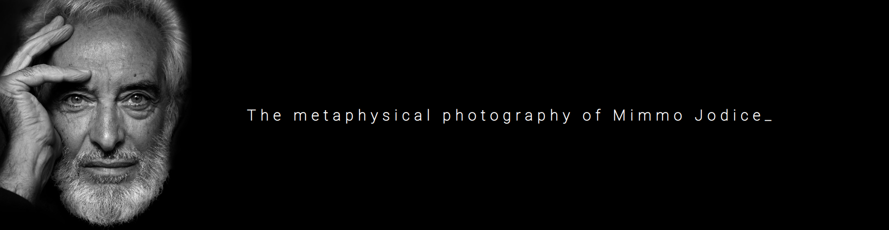
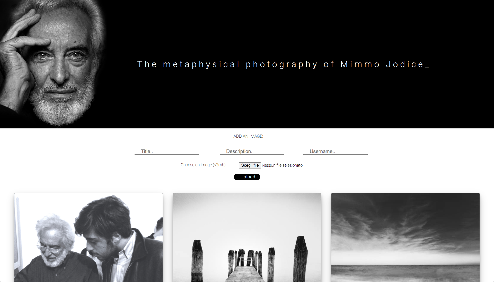
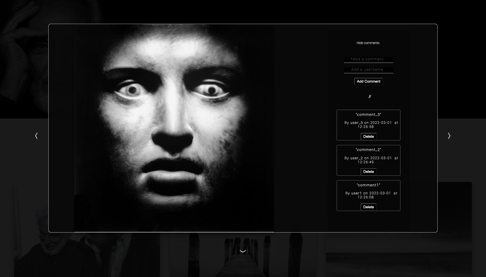
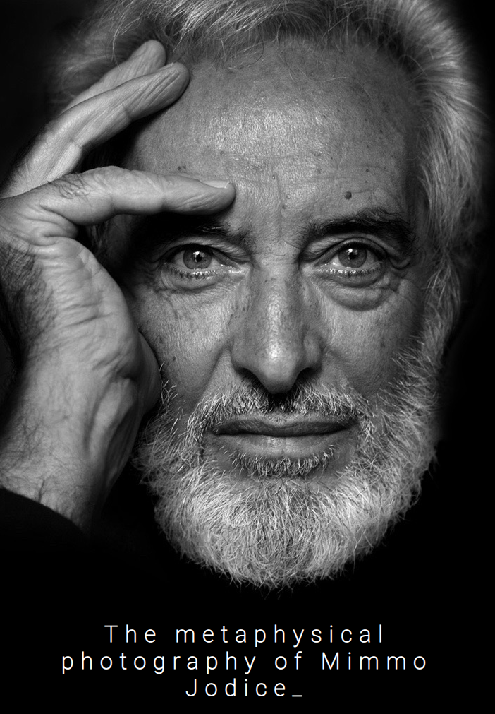

<div align="center">
  
</div>

# Imageboard

Imageboard made during the Full-Stack Web Developer Bootcamp at [Spiced Academy](https://www.spiced-academy.com/en/program/full-stack-web-development/berlin) in Berlin. <br /><br />
An image oriented platform dedicated to the Italian metaphysical photographer Mimmo Jodice.

## Technologies

This project was created with:

-   Front-End: HTML, CSS, JS ([Vue.js](https://vuejs.org))
-   Back-End: [Node.js](https://nodejs.org/en/about/) / [Express](http://expressjs.com) (Csurf, Cookie Session, Bcrypt)
-   Data & Cloud: [PostgreSQL](https://www.postgresql.org), [Multer](https://github.com/expressjs/multer), [AWS S3](https://aws.amazon.com/s3/)

## Setup

First of all clone the repo on your own machine

```bash
git clone https://github.com/lmguerrini/imageboard-mimmo-jodice.git
```

Install all the dependencies required

```bash
npm install
```

Start the server

```bash
node . || npm start
```

Now you should be ready to dive into the Imageboard at http://localhost:8080

## Main features

-   Images uploading on the Cloud (AWS S3) and their deletion
-   Comments on images and their deletion
-   Mobile responsiveness
    <br />

## Preview

### Home

 &emsp;


### Upload picture


### View mode

 &emsp;


### Write/delete comment

 &emsp;


### Delete picture & related comments


### Mobile home optimization

 &emsp;


### Mobile view mode optimization


### Mobile comments optimization


---

[**Back to Imageboard**](#imageboard)
